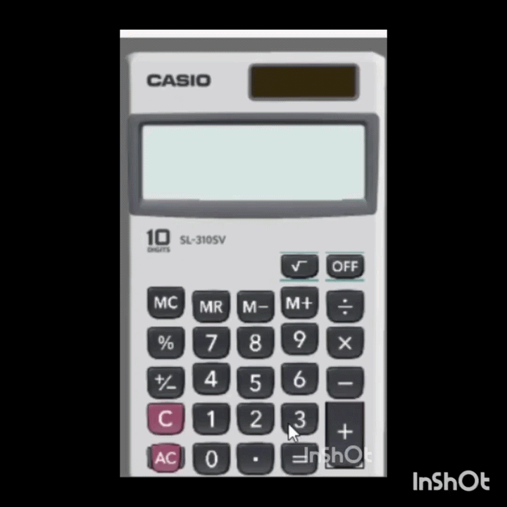

# 🧮 Casio Calculator Clone

<p align="center">
  
</p>

A desktop calculator application built with **C#** and **Windows Forms**, inspired by the classic Casio calculator.

This project was created to practice event-driven programming, application state management, and implementing calculator logic in a desktop environment.

---

## ✨ Features

- ➕ Basic arithmetic operations (+, −, ×, ÷)
- 🧮 Percentage (%)
- 🔄 Sign change (±)
- 💾 Memory functions (MC, MR, M+, M−)
- 🧹 Clear Entry (CE) and All Clear (AC)
- 🎨 Classic Casio-inspired interface
- ⚡ Responsive button interactions

---

## 🛠 Built With

- C#
- .NET
- Windows Forms
- Visual Studio


## 🚀 Getting Started

Clone the repository:

```bash
git clone https://github.com/yourusername/Casio-Calculator.git
```

Open the solution in **Visual Studio** and run the project.

---

## 📚 What I Learned

While building this project, I practiced:

- Event-driven programming
- Managing application state
- Designing a Windows Forms UI
- Implementing calculator logic
- Handling memory operations
- Improving code organization

---

## 💡 Future Improvements

- Scientific calculator mode
- Keyboard shortcuts
- Dark mode
- Calculation history
- Unit conversion

---

## 🤝 Feedback

Suggestions and feedback are always welcome!

If you enjoyed this project, don't forget to ⭐ the repository.
